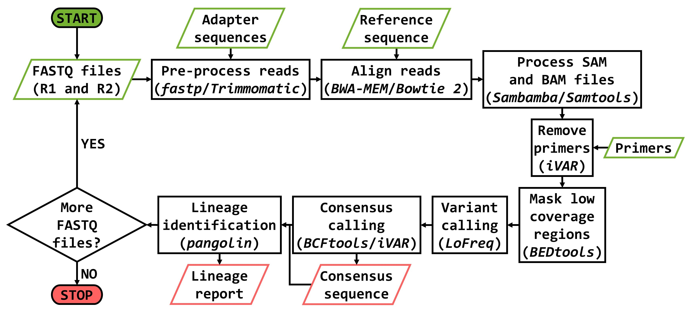

**HAVoC** (***H***elsinki university ***A***nalyzer for ***V***ariants ***o***f ***C***oncern)
=

=

*Description*
-

HAVoC (DOI: https://doi.org/10.1186/s12859-021-04294-2) is a bioinformatic pipeline designed to provide an accessible tool for constructing consensus sequences from SARS-CoV-2 FASTQ files and identifying the variants they belong to. The pipeline can be run on Unix/Linux operating systems either on local computers or in remote servers. HAVoC has a pre-made option to allow it to run in the servers of CSC – IT Center for Science, Finland (https://www.csc.fi/en/home).

Home page: https://www.helsinki.fi/en/projects/havoc

For further inquiries, feel free to contact us via email: [group-havoc@helsinki.fi](mailto:group-havoc@helsinki.fi)

*Instructions*
-

HAVoC can be run to analyze FASTQ files within a directory by typing the following in terminal:

    bash HAVoC.sh [FASTQ directory]

The target directory must contain matching FASTQ files for forward (R1) and reverse (R2) reads, which can be either gzipped (\*.fastq.gz) or uncompressed (\*.fastq).

**HAVoC.sh needs to be in the same directory as NexteraPE-PE.fa, primers.bed and ref.fa.**

The following options can be manually changed in the script file depending on your preferences:

| Option            | Input                 | Function                                                    |
| :---------------- | :-------------------- | :---------------------------------------------------------- |
| thread_num        | Number (8*)           | Number of threads to be used.                               |
| tools_prepro      | fastp* or trimmomatic | Tool for pre-processing FASTQ files.                        |
| tools_aligner     | bowtie or bwa*        | Tool for aligning reads.                                    |
| tools_sam         | sambamba* or samtools | Tool for SAM/BAM processing.                                |
| tools_consensus   | bcftools or ivar*     | Tool for generating consensus sequence.                     |
| min_coverage      | Number (30*)          | Minimum coverage for masking regions in consensus sequence. |
| min_allefreq      | Number (0.5*)         | Minimum allele frequency for indel predictions.             |
| run_pangolin      | yes* or no            | Run Pangolin for lineage identification.                    |
| run_in_csc        | yes or no*            | Allow it to run in the servers of CSC - Finland.            |
| remove_primers    | yes* or no            | Remove primers from BAM.                                    |
| remove_duplicates | yes* or no            | Remove duplicate reads from BAM.                            |

\* By default (**Only one tool can be utilized per option**).

*Dependencies*
-

HAVoC requires certain bioinformatic tools to be installed to run the analyses. The tools are listed below:

| Tool        | Website                                                 | Repository                               | Original article                              |
| :---------- | :------------------------------------------------------ | :--------------------------------------- | :-------------------------------------------- |
| fastp       | N/A                                                     | https://github.com/OpenGene/fastp        | https://doi.org/10.1093/bioinformatics/bty560 |
| Trimmomatic | http://www.usadellab.org/cms/index.php?page=trimmomatic | https://github.com/timflutre/trimmomatic | https://doi.org/10.1093/bioinformatics/btu170 |
| Bowtie 2    | http://bowtie-bio.sourceforge.net/bowtie2/index.shtml   | https://github.com/BenLangmead/bowtie2   | https://doi.org/10.1038/nmeth.1923            |
| BWA-MEM     | <http://bio-bwa.sourceforge.net/>                       | https://github.com/lh3/bwa               | https://doi.org/10.1093/bioinformatics/btp698 |
| Sambamba    | https://lomereiter.github.io/sambamba/                  | https://github.com/biod/sambamba         | https://doi.org/10.1093/bioinformatics/btv098 |
| Samtools    | <https://www.htslib.org/>                               | https://github.com/samtools/samtools     | https://doi.org/10.1093/bioinformatics/btp352 |
| iVar        | <https://andersen-lab.github.io/ivar/html/>             | <https://github.com/andersen-lab/ivar>   | <https://doi.org/10.1186/s13059-018-1618-7>   |
| bedtools    | https://bedtools.readthedocs.io/en/latest/index.html    | https://github.com/arq5x/bedtools2       | https://doi.org/10.1093/bioinformatics/btq033 |
| LoFreq      | https://csb5.github.io/lofreq/                          | https://github.com/CSB5/lofreq           | https://doi.org/10.1093/nar/gks918            |
| BCFtools    | <https://www.htslib.org/>                               | https://github.com/samtools/bcftools     | https://doi.org/10.1093/bioinformatics/btr509 |
| pangolin    | https://cov-lineages.org/pangolin.html                  | https://github.com/cov-lineages/pangolin | https://doi.org/10.1093/ve/veab064            |

These can be installed with the package manager [Miniconda](<https://docs.conda.io/en/latest/miniconda.html>), but [mamba](<https://github.com/mamba-org/mamba>) is recommended.

All dependencies can be conveniently installed to a separate conda environment called **havoc** with the provided **havoc_environment.yml** file and the following command:

    conda env create -f havoc_environment.yml

or when using mamba:

    mamba env create -f havoc_environment.yml

The installation using conda might take a while, so please be patient.

If you are installing to CSC, use **havoc_environment_csc.yml** instead and the following commands:

    module load tykky
    mkdir havoc
    conda-containerize new --prefix havoc --mamba havoc_environment_csc.yml

Additionally, remember to edit the path to the bin folder of this installation within the HAVoC.sh file for it to run properly (search for **path_to_dependencies="your_path/havoc/bin"**), but only if you are using HAVoC in CSC.

Finally, you can test whether everything is set up correctly by running HAVoC with the provided example FASTQ files:

    bash HAVoC.sh Example_FASTQs

*License*
-

HAVoC is covered by GNU GPLv3 and is for non-commercial use only. If you use our pipeline, please cite it properly.

[def]: Isolated.png "Title"